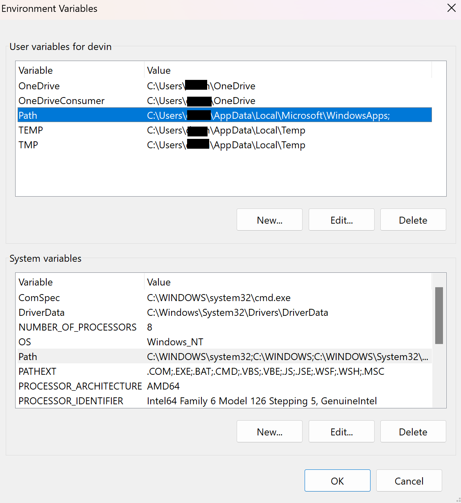

[Cim-Instance]: (https://learn.microsoft.com/en-us/powershell/module/cimcmdlets/get-ciminstance?view=powershell-7.5)
# Setting Up Your Environment
This guide will assist you in setting up your environment so that you can run your *`.ps1`* files from *anywhere* on the command line.
## Disclaimer
1. ***You*** are responsible for **your own** environment.
2. Failure to follow directions or leaving certain elements enabled/disabled according to this guide is ***your*** responsiblity.

## Requirements
- A Windows 🪟 computer 
  - This particular *`.ps1`* file relies on the `Get-CimInstance` cmdlet which is only available on windows computers.
  - Read up on `Get-CimInstance` [on Mcrosoft's website.][Cim-Instance]
- Powershell `5.0` or higher

## Setup
The following steps will allow you to run any *`.ps1`* file from your `powershell` command line.

### 1. Adding a Path to Your Environment (Optional)
The `PATH` is an environment variable which your computer uses to seach for executable files *`.exe`*, *`.ps1`*, *`.sh`*, etc. By adding a path to your `PATH` variable, your system will allow you to execute the files within that directory without explicitly specifying the full path of the file.

- Open windows search and search for "environment"
- Select "Edit the system Environment Variables"
- With the new "Properties" window open, select "Environment Variables..."
- User vs. System Variables
  
  - User
    - The `PATH` variable defined in the **user** space will only be accessible when you are logged in as the current user. This means that if you need to run anything as an **administrator** or as a different **user**, these `paths` will *not* be available.
  - System
    - The system `PATH` is available to all users and should be edited with **caution**.
- Once you have decided which `PATH` you would like to edit, double-click on that `PATH`
- On new window that has opened, select the button labeled "New".
  - If you do *not* see the "New" button, follow these directions:
  1. Select the *end* of the path you see. (This will de-select the entire path).
  2. Add the semi-colon symbol `;` to the end of the path.
  3. Select the "Ok" button to save your changes.
  4. Re-open the `PATH` you just closed.
  5. Select the button labeled "New".
- Enter the full windows path to the directory where you store your *`.ps1`* files
- Click "Ok" to save your changes.
- Click "Ok" again, to save your changes.
- Close the final window.
### 2. Running *`.ps1`* files in Powershell
There are a few ways to run a *`.ps1`* file on the command line. Here are 2.
1. Full Path
    - Open Powershell
    - Type a period `.` followed by the full path to your *`.ps1`* file
      - Example: `. "C:\Users\Username\powershell\Get-HDD.ps1"`
2. `PATH` Enabled Directory
    - With your directory added to the `PATH` variable, Open Powershell.
      - A restart of your shell will be required if your changes were made with powershell open.
    - Type the name of your *`.ps1`* file
      - Example: `Get-HDD.ps1`